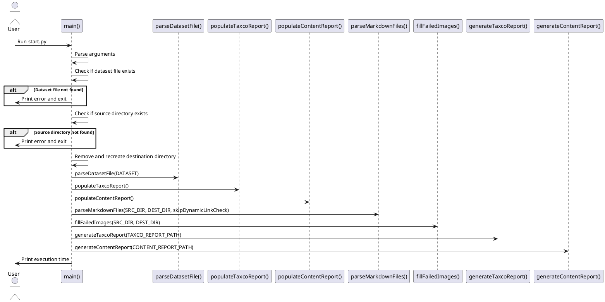
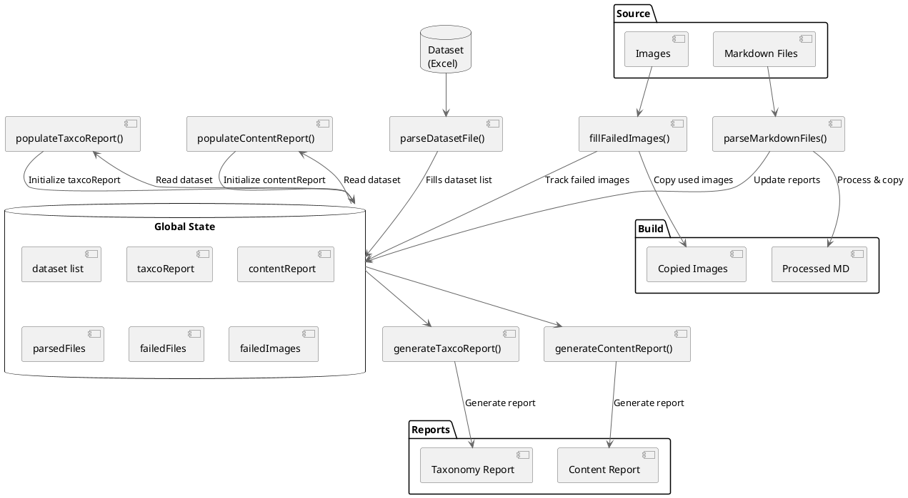

# Content Compiler Script

## Overview
The Content Compiler is a Python script that processes and validates markdown content files based on taxonomy codes and metadata. It performs several key functions:

1. **Taxonomy Validation**: Validates taxonomy codes in markdown files against a predefined dataset
2. **Content Processing**: Processes markdown files, updating tags and metadata
3. **Image Management**: Handles image references and copies images to build directory
4. **Dynamic Link Validation**: Validates and updates dynamic links in content
5. **Report Generation**: Generates detailed reports on content status and taxonomy implementation

## Project Structure
```
compiler/
  ├── start.py              # Main script
  ├── config.py             # Configuration and globals
  ├── files/                # File processing modules
  └── report/               # Report generation modules
dataset/                    # Taxonomy dataset
content_repo/               # Source content directory
```

## Prerequisites
- Python 3.x
- PIP
- Required packages:
```bash
pip install -r requirements.txt
```

Or 
```
pip install pandas openpyxl
```

## Usage
1. Make sure the following folders exist:
```
/dataset/
/content_repo/
```

2. Download the `dataset.xlsx` from: https://github.com/Windesheim-HBO-ICT/Leerlijn-Content-SE-Dataset

4. Place the dataset in the folder:
```
/dataset/
```
So the final location of the dataset will be:
```
/dataset/dataset.xlsx
```

4. Clone the content repo to a separate folder

5. Switch to the branch `Content`

6. Copy the folder `content` and move the folder to:
```
/content_repo/
```

So the final directory will be in:
```
/content_repo/content/
```

7. Open a terminal in the root of the project

8. To compile the content run the command:
```bash
python compiler/runCompiler.py
```

**Options**
```bash
python compiler/runCompiler.py --skip-link-check  # Skip dynamic link validation
```

9. The output will be in the folder
```
/content_repo/build/
```

## Configuration
Key configuration settings in `config.py`:

```python
SRC_DIR = "content_repo/content"                # Source content directory
DEST_DIR = "content_repo/build"                 # Build output directory
DATASET = "dataset.xlsx"                        # Taxonomy dataset file
TAXCO_REPORT_PATH = "taxco_report.md"           # Taxonomy report output
CONTENT_REPORT_PATH = "content_report.md"       # Content report output
```

## Features
### 1. Taxonomy Validation
- Validates taxonomy codes against dataset
- Format: `{tc1}.{tc2}.{tc3}.{type}`
  - Example: `bg-24.2.Alleen-Niveau-Twee.OI`
- Types: OI (Ondersteunende-informatie), DT (Deeltaken), PI (Procedurele-informatie), LT (Leertaken)

### 2. Content Processing
- Parses markdown frontmatter
- Updates tags based on taxonomy
- Validates dynamic links
- Handles image references

### 3. Report Generation
Generates two report types:

#### Taxonomy Report (`taxco_report.md`)
Shows implementation status of taxonomy codes:
- Process steps implementation
- Subject catalog coverage
- Level implementation status (1-3)

#### Content Report (`content_report.md`)
Shows file processing status:
- Work-in-progress files
- Failed files with errors
- Successfully processed files
- Failed image references

## Status Icons
- ✅ Success/Implemented
- ⛔️ Failed/Not implemented
- 🏳️ Not required
- ⚠️ Warning
- 🔨 Work in progress
- 🟠 Unnecessary taxonomy

## Error Handling
Common error types:
- Invalid taxonomy codes
- Missing taxonomy codes
- Dynamic link errors
- Missing images
- Work-in-progress items

## Development

### Testing
Run tests using:
```bash
python compiler/tests/runTests.py
```

Test cases cover:
- Taxonomy validation
- Content processing
- Report generation
- Draft status handling

### Adding New Features
1. Update configuration in `config.py`
2. Implement feature in appropriate module
3. Add test cases in `tests/test_cases/`
4. Update report generation if needed

## Contributing
1. Fork the repository
2. Create feature branch
3. Add tests for new features
4. Submit pull request

## Dependencies
The script requires the following Python packages:
- `pandas`: For handling and manipulating the dataset file.
- `openpyxl`: For reading Excel files.
- `shutil`: For file operations such as copying and removing directories.
- `argparse`: For parsing command-line arguments.
- `pathlib`: For handling filesystem paths in an object-oriented way.

##  `config.py`
This is the config file which stores the different config options.
It's also used to save the state of the reports.
- Source Directory: src/content_repo/content
- Destination Directory: src/content_repo/build
- Dataset File: src/datasets/dataset.xlsx
- Taxonomy Report Path: src/content_repo/taxco_report.md
- Content Report Path: src/content_repo/content_report.md

## Report structure
The script produces two md reports.
- `taxco_report.md`: Is used to see which taxco's are used
- `content_report.md` Is used to see detaild info on specific files.

### `taxco_report.md`
The taxco report has the following structure in the code.

Every tc-1 is a key and stored within the key in the information about the taxco
```
taxcoReport = {
    'rv-8' : {
        'Proces' : "Requirementanalyseproces"
        'Processtap' : "Verzamelen requirements",
        'TC2' : ['x', '~', 'x']
    },
    'pu-13' : {
        'Proces' : "Pakketselectieproces"
        'Processtap' : "Uitvoeren analyse",
        'TC2' : ['x', 'x', 'x']
    }
}
```

### `content_report.md`
The content report has the following structure in the code.

Every tc-3 is it's own key. When a tc-3 is coupled to a tc-1 this is added as a child key. Which tc-1 the data of every content is shown.
```
contentReport = {
    'functioneel-ontwerp' : {
        'oo-15' : {
            'TC2' : ['x', 'x', 'x'],
            LT : ['x', 'x', 'x'],
            OI : ['x', 'x', 'x'], 
            PI : ['x', 'x', 'x'], 
            DT : ['x', 'x', 'x']
        },
        'rs-10' : {
            'TC2' : ['x', 'x', 'x'],
            LT : ['x', 'x', 'x'],
            OI : ['x', 'x', 'x'], 
            PI : ['x', 'x', 'x'], 
            DT : ['x', 'x', 'x']
        },
        'ra-9' : {
            'TC2' : ['x', 'x', 'x'],
            LT : ['x', 'x', 'x'],
            OI : ['x', 'x', 'x'], 
            PI : ['x', 'x', 'x'], 
            DT : ['x', 'x', 'x']
        }
    },
    "Technisch ontwerp": {
        'oo-15' : {
            'TC2' : ['x', 'x', 'x'],
            LT : ['x', 'x', 'x'],
            OI : ['x', 'x', 'x'], 
            PI : ['x', 'x', 'x'], 
            DT : ['x', 'x', 'x']
      }
   }
}
```

## Detailed script workings
The following steps and methods are used to compile the md source files to build files
 
### `start.py`
This is the main script file, this runs the show.

#### `def Main`
Main method which calls the other methods 


## Core Processing Functions

### Content Processing Flow
The script executes the following core functions in sequence:

1. `parseDatasetFile(DATASET)`
   - Reads Excel dataset file using pandas
   - Converts data to CSV format for processing
   - Removes empty rows from dataset
   - Stores parsed data in global dataset list
   - Handles file not found and parsing errors

2. `populateTaxcoReport()`
   - Pre-fills taxonomy report with dataset entries
   - Creates entries for each TC1 code
   - Initializes status as 'not implemented'
   - Sets up process and step information
   - Prepares implementation level tracking

3. `populateContentReport()`
   - Pre-fills content report with dataset entries
   - Creates entries for each TC3 code
   - Initializes status as 'not implemented'
   - Sets up subject and level information
   - Prepares implementation level tracking

4. `parseMarkdownFiles(SRC_DIR, DEST_DIR, skipDynamicLinkCheck)`
   - Processes all markdown files in source directory
   - Validates taxonomy codes and updates tags
   - Checks dynamic links (unless skipped)
   - Copies processed files to build directory
   - Tracks success/failure status for reporting

5. `fillFailedImages(SRC_DIR, DEST_DIR)`
   - Scans for image references in markdown files
   - Copies referenced images to build directory
   - Identifies unused or missing images
   - Maintains folder structure when copying
   - Reports failed image operations

6. `generateTaxcoReport(TAXCO_REPORT_PATH)`
   - Generates taxonomy implementation report
   - Shows status for each taxonomy code level
   - Indicates which process steps are implemented
   - Provides overview of taxonomy coverage
   - Formats report in markdown with status icons

7. `generateContentReport(CONTENT_REPORT_PATH)`
   - Creates detailed content status report
   - Lists work-in-progress files
   - Shows files with validation errors
   - Reports unused/missing images
   - Lists successfully processed files
   - Includes error details and file paths

### Content Processing Pipeline Architecture


